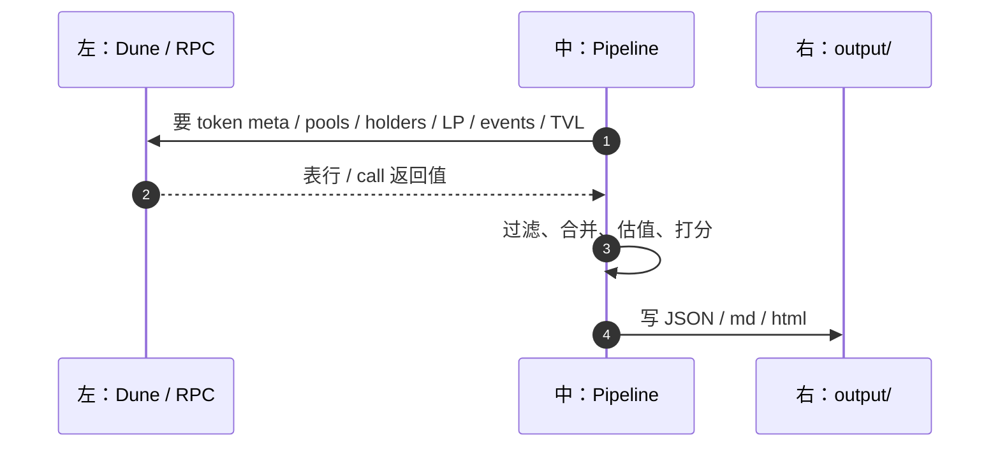
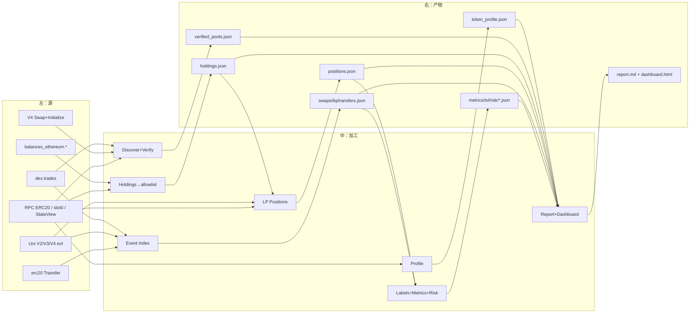
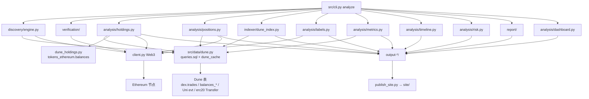

# 数据流走向（具体到表 / 字段 / 产物）

不是步骤标题清单。下面按 `python3 -m src.cli analyze` 真实顺序，写清每一步：

1. **从哪拿**（Dune 哪张表 / RPC 哪个 call）
2. **拿到什么**（字段）
3. **怎么处理**（Python 做什么）
4. **写出什么**（`output/` 文件）
5. **给谁用**（下游哪一步消费）

细节 SQL 全文见 [DUNE_CLI_PIPELINE.md](./DUNE_CLI_PIPELINE.md)。
导师答辩应优先看 [METHODOLOGY_DEFENSE.md](./METHODOLOGY_DEFENSE.md) 和
[ADVISOR_QA.md](./ADVISOR_QA.md)：两份文档包含当前实现审计、口径偏差及口头回答，
并明确指出 latest/to_block、单边/2× TVL 等不能混讲的部分。

---

## 总览：三竖线 + 信号从左到右

```text
┌──────────────────────┐     ┌──────────────────────────┐     ┌─────────────────────┐
│ 左：外部数据源        │     │ 中：Pipeline 加工         │     │ 右：产物              │
│ Dune SQL / Ethereum  │ ──► │ src/cli analyze Steps    │ ──► │ output/*.json        │
│ RPC                  │     │ 1–12                     │     │ report / dashboard   │
└──────────────────────┘     └──────────────────────────┘     └─────────────────────┘
```



---

## 流程图（带「拿了什么 → 变成什么」）



---

## Step 0 — 用户输入（进入 Pipeline 之前）

| 项 | 内容 |
|----|------|
| 命令 | `python3 -m src.cli analyze <TOKEN> --from-block N --to-block M --output-dir output-...` |
| 输入 | token 地址 / 符号 / 名字；区块窗口；可选 `DUNE_API_KEY`、`ETH_RPC_URL` |
| 解析 | `_resolve_or_exit` 把符号变成合约地址，再 `get_web3()` |

之后所有查询都带着：`token`、`from_block`、`to_block`、`chain=ethereum`。

---

## Step 1 — Token Profile

| | |
|--|--|
| **从哪拿** | Ethereum RPC：`symbol()` / `name()` / `decimals()` / `totalSupply()` / `getCode` |
| **拿到什么** | address、symbol、name、decimals、total_supply、是否合约 |
| **怎么处理** | 包成 `TokenProfile`；记录 `decimals_source=onchain` |
| **写出** | `token_profile.json` |
| **给谁用** | 后续所有步骤用 `address` + `decimals` 做金额换算；dashboard 标题 |

**不经过 Dune。**

---

## Step 2 — Pool Discovery（找「窗口里真交易过这个 token 的池」）

并行两路 Dune：

### 2a `query("pools")`

| | |
|--|--|
| **从哪拿** | Dune 表 `dex.trades` |
| **过滤** | `block_number ∈ [from,to]`；bought 或 sold = 目标 token；project ∈ Uniswap / Balancer / Curve |
| **拿到什么** | `project, version, pool_address, token_hint, token_hint2`（按 pool 分组，按成交次数排序） |
| **含义** | 窗口内**实际成交过**的池，不是历史上所有池 |

### 2b `query("pools_v4")`

| | |
|--|--|
| **从哪拿** | `uniswap_v4_ethereum.PoolManager_evt_Swap` ⋈ `..._evt_Initialize` |
| **拿到什么** | `pool_id`（bytes32）、`currency0/1`、`fee`、`hooks` |
| **为什么单独** | V4 不能把 PoolManager 合约地址当「一个池」 |

### 2c 本地合并

```text
标准化 protocol/version
→ 处理 Balancer poolId
→ 合并 V2/V3/Curve/Balancer 地址池 + V4 poolId
→ 可选 --discovery-rpc（默认 off，不再扫链上 factory）
```

| **写出** | `pool_candidates.json` |
| **给谁用** | Step 3 校验 |

也可 `--pools-file xxx.json` 跳过本步直播查询，直接加载已保存的 Dune pools 导出。

---

## Step 3 — Pool Verification（链上确认池真的含这个 token）

| | |
|--|--|
| **从哪拿** | RPC：bytecode、`token0`/`token1`、fee、V4 StateView 等 |
| **输入** | Step 2 的 candidates |
| **怎么处理** | 每个候选打 `verified=true/false`、custody 地址、置信度；V4 校验 currency 是否含目标 token |
| **写出** | `verified_pools.json` |
| **硬停** | verified = 0 → pipeline 退出 |
| **给谁用** | Holdings 标池地址、Positions 扫哪些池、Index 查哪些 pool、Metrics 算 TVL |

**不新增 Dune。**

---

## Step 4 — Holdings / Leaderboard（先定「人」，再查 LP）

第一次调用时 **还没有** indexed transfers，所以走 Dune 发现地址。

### 4a 找持有人地址（级联）

```text
① holders
     表：balances_ethereum.daily_updates（+ ethereum.blocks 把 block→日期）
     条件：token = 目标；[valid_from, valid_to) 与窗口日期相交；balance_raw > 0
     得到：DISTINCT address
     缺口：同一天买完又卖光的地址会漏

② 失败 → holders_from_transfers
     表：erc20_ethereum.evt_Transfer
     得到：窗口内 from/to 去重地址

③ 再失败 → transfer_addresses
     同上 Transfer，多带 tx_count
```

### 4b 补余额

```text
query("balances")
  表：balances_ethereum.latest
  入参：地址列表
  得到：address, balance_raw

失败 → RPC ERC20.balanceOf(addr, to_block)
```

### 4c 历史双点余额（另一条路）

`src/data/dune_holdings.py` 一次查 `tokens_ethereum.balances`（期初快照 + 窗口内变化点），本地推出 start / end / peak / moved in-out（dashboard Top Holders 期初/期末/净变动/峰值列）。

### 4d 本地处理

```text
按余额排序
→ 标记 is_pool（地址是否等于 verified pool / custody）
→ leaderboard = 非池地址
→ owner_allowlist = leaderboard 前 100 个地址   ← 关键：传给 Step 5
```

| **写出** | `holdings.json`、`holdings_table.csv`、`pool_identification_table.csv` |
| **给谁用** | Step 5 的 `owner_allowlist`；Step 12 dashboard Top Holders |

---

## Step 5 — LP Positions（只问：排行榜这些人有没有开着仓）

**输入：** `verified_pools` + `owner_allowlist`（不是全池所有 LP）。  
此时 Step 6 事件还没索引，传入的 events 为空。

### 5a Uniswap V3

主查询 `positions_uniswap_v3_snapshot`（Dune 一次做完）：

```text
Pair Mint
→ 同 tx 的 NPM ERC721 mint Transfer → nft_token_id
→ tickLower / tickUpper
→ SUM IncreaseLiquidity − SUM DecreaseLiquidity = net liquidity
→ to_block 前最后 owner
→ 只留 net > 0 且 owner ∈ allowlist
```

得到行：`nft_token_id, pool_address, tick_lower, tick_upper, liquidity, owner`。

失败则 staged：

```text
positions_uniswap_v3_base
→ positions_uniswap_v3_liquidity（按 tokenId 批）
→ positions_nft_owners
```

估值：

```text
query("pool_sqrt_price_v3")  ← 每个池 to_block 前最后一笔 Swap 的 sqrtPriceX96
或 RPC slot0
→ 本地用 tick + liquidity 算 token0/token1 数量与 share
```

### 5b Uniswap V4

```text
query("positions_uniswap_v4_liquidity")
  按 poolId + salt 汇总 liquidityDelta，只留净正仓

query("positions_nft_owners")
  NFT 最新 owner

RPC StateView
  slot0 / 池内 active liquidity → 算 in-range share
```

| **写出** | `positions.json`、`position_summary.json` |
| **给谁用** | Labels（LP owner）、Metrics（LP 集中度）、Dashboard 点开 holder 看 LP 组合 |

---

## Step 6 — Event Indexing（窗口内「发生了什么」）

按 `--index-source auto|dune|rpc`。有 `DUNE_API_KEY` 时默认 Dune，最多 6 个并行 job；每个 SQL 内部按 2000 blocks 串行切块。

### 6a Swaps — `query("swaps")`

| | |
|--|--|
| **从哪拿** | `dex.trades` |
| **过滤** | 区块窗口；bought/sold 含目标 token（**不限** verified pool） |
| **拿到什么** | block/time/tx、protocol/version/pool、actor、bought/sold token、raw amount、`amount_usd` |
| **变成** | `swaps.json` 里的 swap 事件 |

### 6b 流动性（池级聚合，不再下每个 LP 身份）

| SQL | 源表倾向 | 聚合键 | 得到 |
|-----|----------|--------|------|
| `liquidity_uniswap_v2_mint/burn` | V2 Pair Mint/Burn | pool + block | `SUM(amount0/1)`, `event_count` |
| `liquidity_uniswap_v3_mint/burn` | V3 Pair Mint/Burn | pool + block | 同上 |
| `liquidity_uniswap_v4_modify` | V4 ModifyLiquidity | poolId + block + delta 正负 | `SUM(liquidityDelta)`, `event_count` |

Python normalize 成：

```text
LIQUIDITY_ADD / LIQUIDITY_REMOVE
aggregation_scope = pool_block
```

**故意不拿：** sender、recipient、tx_hash、tick、salt（这些属于 Step 5 仓位，不属于撤池时间线）。

### 6c Transfers — `query("transfers")`（非 `--fast-mode`）

| | |
|--|--|
| **从哪拿** | `erc20_ethereum.evt_Transfer` |
| **拿到什么** | from、to、amount_raw、tx、block/time/log |
| **用途** | holdings refresh、DEX 关联、wallet activity |

| **写出** | `swaps`、`liquidity_events`、`transfers`、`position_events` canonical tables（JSON 和/或 Parquet）、`index_source.json`、checkpoint / `dune_cache`；combined stream 仅在内存中构建 |
| **给谁用** | Labels、Metrics 撤池与 volume fallback、Timeline、Holdings refresh |

---

## Step 7 — Address Labels

| | |
|--|--|
| **从哪拿** | **不再查 Dune**；RPC 查 token deployer；其余吃 Step 5+6 内存数据 |
| **输入** | positions（LP owner）、swaps、liquidity 聚合行、transfers、verified pools |
| **怎么处理** | 给地址打 deployer / pool / LP / trader 等标签；DEX 协议标签主要来自 **positions 的 owner**（聚合 liq 行没有 actor） |
| **写出** | `address_labels.json` |
| **给谁用** | Risk、Dashboard 徽章 |

---

## Step 8 — Metrics（第二轮主要 Dune：图数据）

### 8a TVL 时间线（并行）

**`pool_balance_timeline`**

```text
源：ethereum.blocks + utils.days + balances_ethereum.daily_updates
做：block 窗口 → 日期窗口 → 把稀疏 [valid_from,valid_to) 展开成「每日 × 每个 pool custody」的 balance_raw
注意：V4 用 PoolManager 的 20-byte custody 地址，不是 bytes32 poolId
```

**价格（优先本地）**

```text
源：Step 6 swaps.json（不再重查 dex.trades）
做：按 pool + hour/day 桶 → amount_usd / token 量 → 桶内最后成交价
无 swaps → 才跑 Dune price_timeline
```

**本地合并：**

```text
TVL_pool(t) = (balance_raw / 10^decimals) × price_usd
再按时间点 sum 所有池 → tvl_timeline.json
```

失败则：用 Step 6 的 swaps + Mint/Burn 聚合在本地累加（`event_accumulate_fallback`）。

### 8b Volume — `volume_timeline`

```text
源：Step 6 swaps.json（主路径，不再重查 dex.trades）
本地：按 hour/day × pool 对目标 token volume 与 USD SUM
无 swaps → Dune volume_timeline
→ volume_timeline.json
```

### 8c 本地再算（不查 Dune）

| 计算 | 吃什么 | 产出语义 |
|------|--------|----------|
| pool concentration | 各池 TVL | `main_pool_share` 等 |
| LP concentration | positions | `top_lp_share` |
| withdrawal severity | liquidity_events + 价格/TVL | `quantified / liquidity_delta_only / unmapped` 覆盖状态；有金额时再产出 `per_pool_removals`、USD、占池 TVL 比 |
| wallet activity | swaps（+ transfers） | 窗口内 P99 Trade / Mover / Volume / Activity 自适应标签；可显式切回固定阈值 |

| **写出** | `metrics.json`、`tvl_timeline.json`、`volume_timeline.json` |
| **给谁用** | Risk、Dashboard 曲线 / Top Movers / Notable Wallets / 撤池表 |

---

## Step 9 — Timeline

| | |
|--|--|
| **从哪拿** | 仅 Step 6 已落盘/内存的 events（**不查 Dune**） |
| **怎么处理** | 按时间排序；若有 `--incident-block` 切前后窗；估 liquidity migration |
| **写出** | `incident_timeline.json`、`crash_window.json` |
| **给谁用** | Risk 的 migration 调整、报告叙述 |

---

## Step 10 — Risk

| | |
|--|--|
| **从哪拿** | 仅本地：pool/LP concentration、withdrawal severity、TVL timeline、labels、deployer、migration |
| **怎么处理** | 加权打分，例如 pool 集中度、LP 集中度、撤池严重度等；migration 可下调；× evidence_confidence；映射 LOW / MEDIUM / HIGH |
| **写出** | `risk_assessment.json`（含 `final_score`、`risk_level`、分项解释） |
| **给谁用** | report、dashboard 风险卡 |

---

## Step 11 — Report + Holdings Refresh

### 11a Report

把前面所有结构体塞进模板 → **`report.md`**（不拉链）。

### 11b Holdings 二次刷新（有 transfers 且非 fast_mode）

```text
再调 analyze_holdings(..., transfers=indexed)
source=auto 时：直接用 transfers 抽地址，不再跑 holders SQL
仍可能：dune_holdings 双点余额、balances SQL、RPC balanceOf
覆盖第一次的 holdings.json
```

**重要：** Step 5 的 LP allowlist **不会**按新排名重算。

---

## Step 12 — Dashboard（纯本地读文件）

| **读** | `token_profile`、`verified_pools`、`holdings`、`positions`、`metrics`/`tvl`/`volume`、timeline、risk、events… |
| **再写** | `address_dex.json`（Uniswap/Curve/Balancer 标签）、`portfolios.json`（holder→LP 明细）、**`dashboard.html`** |
| **不访问** | Dune / RPC |
| **另写** | `timing.json`（各 Step 耗时） |

可选：`python3 scripts/publish_site.py` 把多个 `output-*` 打进 `site/` → GitHub Pages。

---

## 一张表看完：源 → 处理 → 文件

| Step | 左：主要源 | 中：关键处理 | 右：主要文件 |
|------|------------|--------------|--------------|
| 1 | RPC ERC20 | 读 meta | `token_profile.json` |
| 2 | `dex.trades` + V4 Swap/Initialize | 窗口内活跃池发现 | `pool_candidates.json` |
| 3 | RPC pool 状态 | 校验 token 归属 | `verified_pools.json` |
| 4 | `daily_updates` / Transfer / `latest` + RPC | 排名 + allowlist | `holdings.json` |
| 5 | V3/V4 position SQL + slot0/StateView | 只估 top holders 的开仓 | `positions.json` |
| 6 | `dex.trades` + Mint/Burn/Modify + Transfer | swap 明细；liq **按池聚合** | `swaps/liquidity/transfers.json` |
| 7 | 内存 + RPC deployer | 打标签 | `address_labels.json` |
| 8 | balance timeline ∥ price + volume | TVL/量能曲线 + 撤池/钱包标签 | `metrics.json` 等 |
| 9 | events | 时间线 / migration | `incident_timeline.json` |
| 10 | metrics+labels | 风险分 | `risk_assessment.json` |
| 11 | 全部产物 | md + holdings 刷新 | `report.md` |
| 12 | output 目录 | HTML + DEX/portfolio | `dashboard.html` |

Dashboard 的池曲线采用扩展颜色与虚实线组合区分多池。DEX 储备饼图来自 holdings 中 `is_pool=true` 的正余额行，表示目标 token 在已识别池/托管地址之间的快照分布；V4 PoolManager 为共享托管，不应把该扇区解释为单个 V4 池的完整 TVL。

`All Verified Pools` 的 liquidity share 只在成功测量的 `per_pool_tvl` 分母内计算。页面同时显示 measured/verified 覆盖率；缺少可靠 V4 per-pool 测量时写 `Not measured`，不把未知值伪装成 `0%`。

Non-pool holder 展示在 Dashboard 内再次执行明确排名：排除 pool/custody 与非正 end balance，按期末余额降序，图表取前 10、表格取前 20；其范围仍受 holdings 覆盖率限制。

Liquidity Withdrawals 不再把 V4 `ModifyLiquidity` 的 token0/token1 零占位解释成真实撤出 0。数据层记录 `quantified`、`liquidity_delta_only`、`unmapped` 三态；看板明确显示 `Token amount not returned`，依赖金额的 USD/TVL 列显示 `Cannot calculate`，并单独保留 raw liquidity change 与底层 `event_count`。只有 `quantified` 状态下的 0 才表示测得的真实 0。

---

## 架构图（模块怎么接到源和文件）



---

## 数据依赖（谁必须等谁）

```text
Profile
  └─► Discover ─► Verify ─┬─► Holdings ─► allowlist ─► Positions
                          │                              │
                          └─► Event Index ───────────────┼─► Labels
                                    │                    │
                                    ├─► Metrics (TVL 可再查 Dune)
                                    ├─► Timeline
                                    └─► Holdings refresh
                                              │
                         Positions + Metrics + Labels + Timeline
                                              │
                                            Risk
                                              │
                                      Report → Dashboard
```

口诀：

```text
先定池（Discover/Verify）
再定人（Holdings → allowlist）
再定仓（Positions）
再定事（Index：swap / 聚合撤池 / transfer）
再定图与分（Metrics / Risk）
最后只读文件出报告和页面
```
